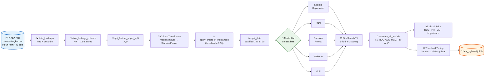
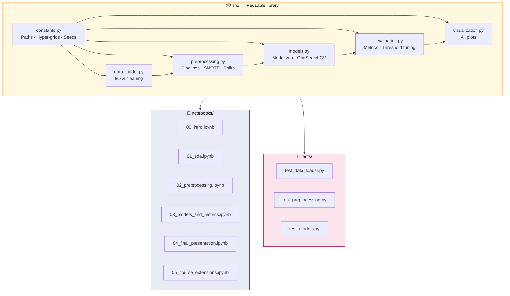
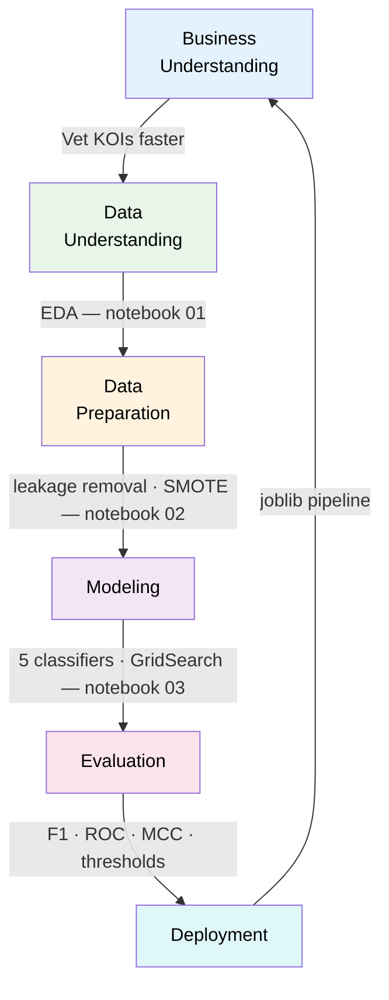
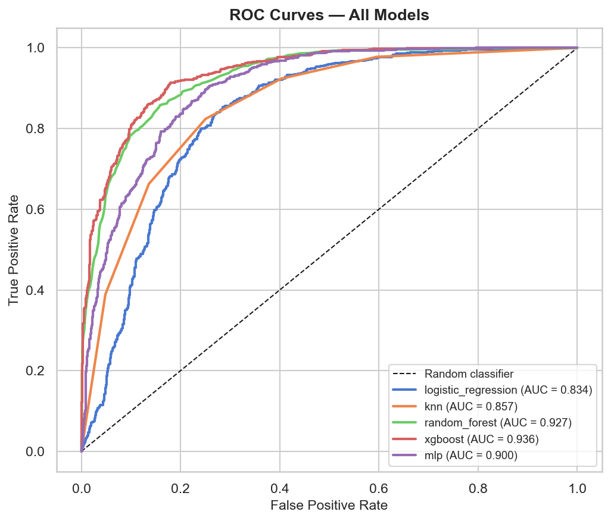
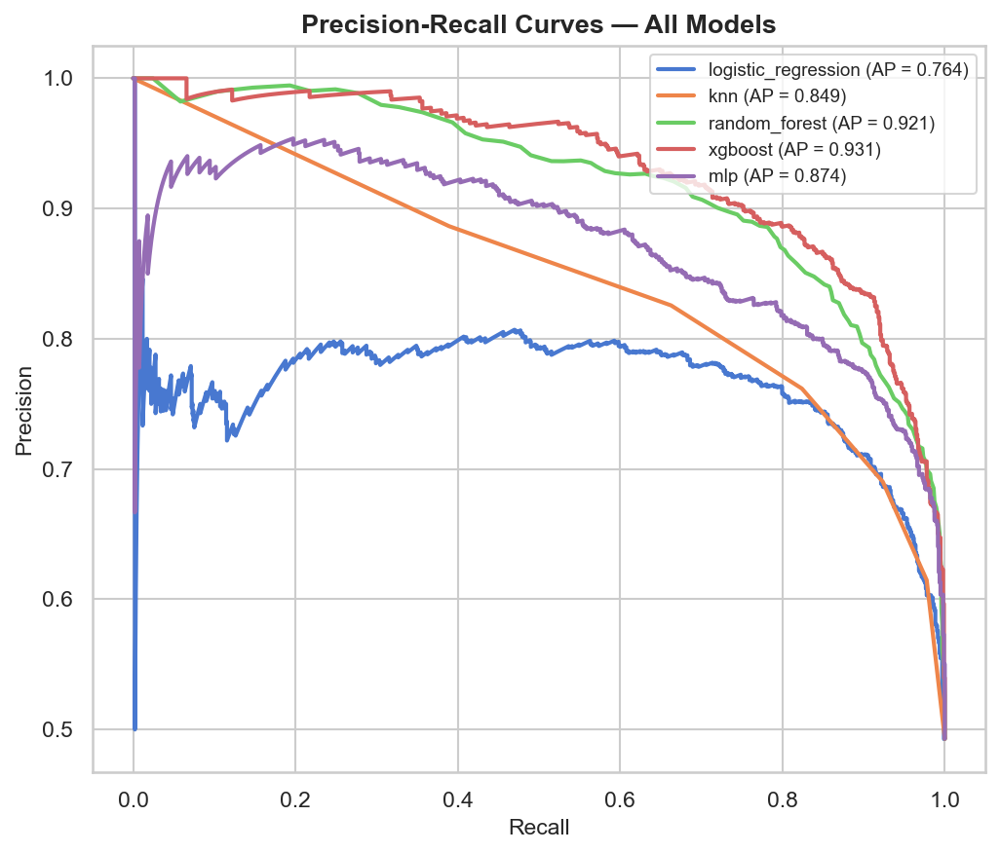
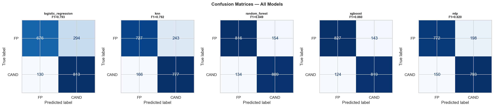
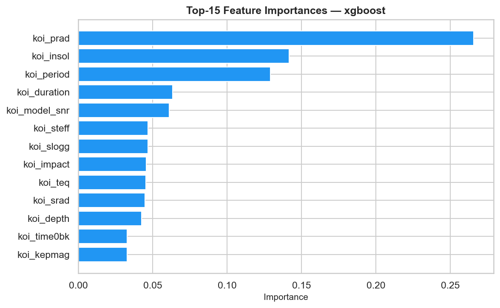
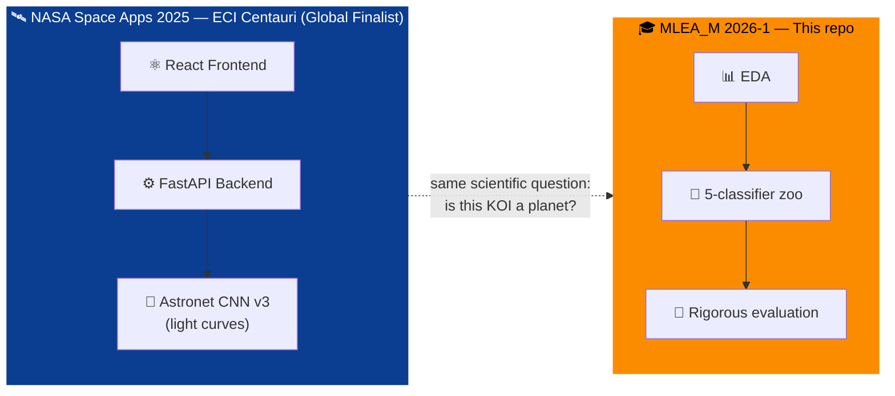

# 🪐 Exoplanet ML Classifier — NASA Kepler KOI

```text
███████╗██╗  ██╗ ██████╗ ██████╗ ██╗      █████╗ ███╗   ██╗███████╗████████╗
██╔════╝╚██╗██╔╝██╔═══██╗██╔══██╗██║     ██╔══██╗████╗  ██║██╔════╝╚══██╔══╝
█████╗   ╚███╔╝ ██║   ██║██████╔╝██║     ███████║██╔██╗ ██║█████╗     ██║
██╔══╝   ██╔██╗ ██║   ██║██╔═══╝ ██║     ██╔══██║██║╚██╗██║██╔══╝     ██║
███████╗██╔╝ ██╗╚██████╔╝██║     ███████╗██║  ██║██║ ╚████║███████╗   ██║
╚══════╝╚═╝  ╚═╝ ╚═════╝ ╚═╝     ╚══════╝╚═╝  ╚═╝╚═╝  ╚═══╝╚══════╝   ╚═╝
        Binary classification of NASA Kepler Objects of Interest
```

<p align="center">
  
  
  
  
  
  
  
  
  
</p>

<p align="center">
  <b>A reproducible, course-grade machine-learning pipeline that decides whether a Kepler Object of Interest is a genuine exoplanet candidate or a false positive, using nothing but the photometric and stellar features that NASA records before vetting.</b>
</p>

<p align="center">
  🔗 <b>Related Repositories:</b><br/>
  <a href="https://github.com/AnderssonProgramming/exoplanet-ml-classifier-design-system">Exoplanet Design System</a> • 
  <a href="https://github.com/Maestria-en-Ciencia-de-datos-HWTNM/Machine_Learning_Intro">Machine Learning Intro</a>
</p>

---

## 🎯 Table of Contents

1. [Why This Project](#-why-this-project)
2. [The Problem](#-the-problem)
3. [Dataset](#-dataset)
4. [System Architecture](#-system-architecture)
5. [Methodology](#-methodology)
6. [Results](#-results)
7. [Repository Layout](#-repository-layout)
8. [Reproduce the Experiments](#-reproduce-the-experiments)
9. [Application & Impact](#-application--impact)
10. [NASA Space Apps Heritage](#-nasa-space-apps-heritage)
11. [Authors & Course](#-authors--course)
12. [License & Citation](#-license--citation)

---

## 🚀 Why This Project

The **Kepler Space Telescope** observed more than 150 000 stars and produced almost
10 000 *Kepler Objects of Interest* (KOIs), such as periodic dimming events that **could**
be caused by a planet transiting in front of its host star, but could equally be
caused by eclipsing binary stars, instrument noise, or stellar variability.

NASA's vetting pipeline assigns each candidate a final disposition (`CONFIRMED`,
`CANDIDATE`, or `FALSE POSITIVE`), but that process is partly manual and slow.
**Automating the triage step** is therefore a high-impact data-science problem:
a reliable classifier can reduce the load on human vetters and accelerate
follow-up observation campaigns.

This repository documents a full Machine-Learning workflow, from raw CSV to
deployable pipeline, and was developed for the *MLEA_M — Machine Learning*
course of the **Master in Data Science** at **Escuela Colombiana de Ingeniería
Julio Garavito**, period 2026-1.

> 🏆 **It is also a continuation of the work that earned us a Global Finalist
> position at the [NASA Space Apps Challenge 2025](https://www.spaceappschallenge.org/).**

---

## 📋 The Problem

| Aspect | Description |
| --- | --- |
| **Type of problem** | Supervised **binary classification**. |
| **Input** | 13 numeric features (transit photometry + stellar properties). |
| **Target** | `koi_pdisposition` ∈ {`CANDIDATE` (1), `FALSE POSITIVE` (0)}. |
| **Decision supported** | Should the KOI be promoted to a follow-up observation queue? |
| **Risk profile** | False negatives (missed planets) are scientifically more costly than false positives (wasted telescope time). The metric must reflect that. |

We frame this as binary classification: not multi-class because the practical
question for a vetting pipeline is *"is this candidate worth keeping?"*. The
finer `CONFIRMED` vs `CANDIDATE` distinction depends on follow-up data not present
in the table.

---

## 📊 Dataset

| Property | Value |
| --- | --- |
| **Source** | [NASA Exoplanet Archive — Cumulative KOI Table](https://exoplanetarchive.ipac.caltech.edu/cgi-bin/TblView/nph-tblView?app=ExoTbls&config=cumulative) |
| **Rows** | 9 564 KOIs |
| **Columns** | 49 raw → 13 used after leakage removal |
| **Class balance** | 4 717 CANDIDATE / 4 847 FALSE POSITIVE (≈ 49 / 51 %) |
| **Period covered** | Kepler primary mission |
| **License** | Public domain (NASA / IPAC) |

### 🧹 Leakage columns we drop

The raw table includes columns that **encode the label** or are produced **after**
the classification was made. Keeping them makes a model that looks brilliant on
paper and is useless in production:

```
koi_disposition  koi_score  koi_fpflag_nt  koi_fpflag_ss  koi_fpflag_co  koi_fpflag_ec
kepid           kepoi_name kepler_name    koi_comment
```

### 🔬 Features actually used

```text
koi_period       Orbital period (days)
koi_time0bk      Transit epoch (BJD)
koi_impact       Impact parameter (sky-projected distance at transit)
koi_duration     Transit duration (hours)
koi_depth        Transit depth (ppm)
koi_prad         Planetary radius (Earth radii)
koi_teq          Equilibrium temperature (K)
koi_insol        Insolation flux (Earth units)
koi_steff        Stellar effective temperature (K)
koi_slogg        Stellar surface gravity (log cgs)
koi_srad         Stellar radius (Solar radii)
koi_kepmag       Kepler band magnitude
koi_model_snr    Transit model signal-to-noise ratio
```

---

## 🏗 System Architecture

### High-level pipeline



### Module dependency graph



### CRISP-DM mapping



---

## 🧪 Methodology

### Why these seven classifiers?

Each model represents a *different inductive bias*, which is exactly what the
course rubric asks for and what produces honest comparisons:

| Family | Algorithm | What it tests | Strengths | Weaknesses |
| --- | --- | --- | --- | --- |
| **Linear** | Logistic Regression | Are the classes linearly separable in feature space? | Fast, interpretable coefficients | Weak with non-linear interactions |
| **Instance-based** | k-Nearest Neighbours | Does local geometry carry the signal? | No assumptions, captures local clusters | Slow at inference, scale-sensitive |
| **Single CART** | Decision Tree | Where would axis-aligned splits separate the classes? | Maximum interpretability, no scaling needed | Unstable, high variance on small data perturbations |
| **Margin-based** | Support Vector Machine (RBF) | Does a kernelised margin maximiser beat trees here? | Strong theory, RBF handles non-linear boundaries | Probability calibration is expensive, large *n* slow |
| **Tree ensemble (bagging)** | Random Forest | Do non-linear feature interactions help? | Variance reduction via bagging, native importance | Larger memory footprint |
| **Tree ensemble (boosting)** | XGBoost | Does sequential error-correction beat bagging? | State of the art on tabular data, regularised | More hyper-parameters |
| **Neural network** | MLP (1–3 hidden layers) | Does a universal approximator help here? | Flexible non-linear function approximator | Sensitive to scale/seed |

The rows cover every algorithm that gives the comparison real breadth instead
of stacking variants of the same family.

### Mathematical formulation

**Logistic Regression** — log-odds linear model

$$
\log \frac{P(y=1\mid \mathbf{x})}{1 - P(y=1\mid \mathbf{x})} \;=\; \beta_0 + \boldsymbol{\beta}^{\top}\mathbf{x},
\qquad
P(y=1\mid \mathbf{x}) \;=\; \sigma(\beta_0 + \boldsymbol{\beta}^{\top}\mathbf{x}).
$$

**Standardisation** (applied to all features; required for KNN, LR, MLP)

$$
z = \frac{x - \mu_\text{train}}{\sigma_\text{train}}.
$$

**SMOTE** (Synthetic Minority Over-sampling Technique)

$$
\mathbf{x}_\text{new} = \mathbf{x}_i + \lambda(\mathbf{x}_{i_{\text{nn}}} - \mathbf{x}_i),\quad \lambda\sim U(0,1).
$$

**Cross-entropy loss** (used by LR, XGBoost, MLP)

$$
\mathcal{L} = -\frac{1}{N}\sum_{i=1}^{N}\Big[y_i\log\hat{p}_i + (1-y_i)\log(1-\hat{p}_i)\Big].
$$

**Matthews Correlation Coefficient** (gold-standard binary metric)

$$
\text{MCC} = \frac{TP\cdot TN - FP\cdot FN}{\sqrt{(TP+FP)(TP+FN)(TN+FP)(TN+FN)}}.
$$

### Decision-threshold optimisation

Two operating points are evaluated besides the default 0.5:

- **Youden's J**: $J = \text{TPR} - \text{FPR}$, maximised on the ROC curve.
- **F1-optimal**: argmax of $F_1 = 2\,\frac{P\cdot R}{P+R}$ over the precision-recall curve.

---

## 📈 Results

### Final test-set leaderboard

The full table below is produced by `evaluate_all_models()` on the held-out test
split (20 % stratified). XGBoost and MLP rows reflect the **tuned** models
(GridSearchCV, 5-fold, F1 scoring). The other three rows reflect default
hyper-parameters.

| Model | Accuracy | Balanced Acc. | Precision | Recall | **F1** | ROC-AUC | PR-AUC | MCC |
| --- | ---: | ---: | ---: | ---: | ---: | ---: | ---: | ---: |
| **🏆 xgboost (tuned)** | **0.8604** | **0.8605** | **0.8514** | 0.8685 | **0.8598** | **0.9361** | **0.9314** | **0.7210** |
| random_forest | 0.8495 | 0.8496 | 0.8401 | 0.8579 | 0.8489 | 0.9271 | 0.9199 | 0.6991 |
| mlp (tuned) | 0.8202 | 0.8202 | 0.8130 | 0.8250 | 0.8189 | 0.9006 | 0.8828 | 0.6404 |
| logistic_regression | 0.7784 | 0.7795 | 0.7344 | **0.8621** | 0.7932 | 0.8341 | 0.7645 | 0.5660 |
| knn | 0.7862 | 0.7867 | 0.7618 | 0.8240 | 0.7916 | 0.8568 | 0.8067 | 0.5747 |

> **Best model:** *XGBoost (tuned)* — F1 ≈ 0.860, ROC-AUC ≈ 0.936, MCC ≈ 0.721.
> **Best XGBoost configuration:** `n_estimators=200`, `max_depth=7`,
> `learning_rate=0.05`, `subsample=0.8`.

### Visual evidence

| | |
| --- | --- |
|  |  |
|  |  |

### Threshold analysis (best model)

| Threshold | F1 | Precision | Recall | MCC |
| --- | ---: | ---: | ---: | ---: |
| Default (0.5) | 0.8598 | 0.8514 | 0.8685 | 0.7210 |
| Youden's J (0.43) | 0.8624 | 0.8285 | 0.8993 | 0.7223 |
| F1-optimal (0.43) | 0.8624 | 0.8285 | 0.8993 | 0.7223 |

> Lowering the threshold trades a small precision loss for a meaningful recall
> gain, the right call when **missed planets cost more than wasted follow-ups**.

---

## 🎓 Course-Aligned Extensions

Notebook **`05_course_extensions.ipynb`** complements the main leaderboard with
the techniques covered in classroom sessions, so the project
exercises every topic of the course rubric, not just the five families that
fight for first place:

| Session | Topic | Where it lives |
| --- | --- | --- |
| **04 — Supervised learning** | SVM (RBF kernel) tuned over `C × γ`; single Decision Tree baseline | `src/models.py` (in the zoo) and §2–§3 of notebook 05 |
| **05 — ML modelling** | Filter / wrapper / embedded feature selection, side-by-side; learning curve for the winning model | `src/feature_selection.py` + §4 and §7 of notebook 05 |
| **06 — Unsupervised learning** | GMM with BIC/AIC component selection, t-SNE & UMAP non-linear projections | `src/visualization.py` + §5–§6 of notebook 05 |

Three takeaways the extensions surface that the main leaderboard cannot:

- **All three selectors agree** on `koi_model_snr`, `koi_prad`, and `koi_depth`
  as essential, independent evidence for the XGBoost feature-importance plot.
- **GMM ellipses** highlight the overlap region near the class boundary, which
  is exactly where threshold tuning on the ROC curve recovers recall.
- **The learning curve flattens** before reaching the full training set,
  meaning more KOI rows are unlikely to lift F1 further, the next gain has
  to come from richer features (light-curve morphology, stellar metallicity).

---

## 📁 Repository Layout

```text
exoplanet-ml-classifier/
├── .github/workflows/ci.yml          # GitHub Actions: lint + test on every push
├── data/
│   ├── raw/cumulative_koi.csv        # Source dataset (NASA / IPAC)
│   └── processed/                    # Generated train / val / test CSVs
├── notebooks/
│   ├── 00_intro.ipynb                # Project context & problem framing
│   ├── 01_eda.ipynb                  # Exploratory Data Analysis
│   ├── 02_preprocessing.ipynb        # Leakage removal · SMOTE · split
│   ├── 03_models_and_metrics.ipynb   # Train · tune · compare 5 classifiers
│   ├── 04_final_presentation.ipynb   # End-to-end pipeline demo
│   └── 05_course_extensions.ipynb    # SVM · CART · selectors · GMM · t-SNE · UMAP
├── reports/
│   ├── figures/                      # All saved visualisations (.png)
│   └── paper/                        # IEEE LaTeX paper sources
├── models/
│   └── best_xgboost.joblib           # Persisted best pipeline
├── scripts/                          # One-off notebook builders
│   ├── _build_extensions_nb.py       # Rebuilds 05_course_extensions.ipynb from source
│   └── _build_intro_nb.py            # Rebuilds 00_intro.ipynb from source
├── src/                              # Reusable library
│   ├── constants.py                  # Single source of truth for paths / grids
│   ├── data_loader.py                # CSV I/O, leakage handling
│   ├── preprocessing.py              # ColumnTransformer · SMOTE · splits
│   ├── models.py                     # Model zoo · GridSearchCV · persistence
│   ├── evaluation.py                 # All metrics · threshold tuning
│   ├── feature_selection.py          # Filter · wrapper · embedded selectors
│   └── visualization.py              # All plots (matplotlib / seaborn)
├── tests/                            # 78 unit tests · 100 % of public API
│   ├── test_data_loader.py
│   ├── test_preprocessing.py
│   ├── test_models.py
│   ├── test_evaluation.py
│   ├── test_feature_selection.py
│   └── test_visualization.py
├── COMMIT_CONVENTION.md              # Conventional Commits cheat-sheet
├── LICENSE                           # Apache 2.0
├── requirements.txt
└── setup.py
```

---

## ⚙️ Reproduce the Experiments

### 1. Clone & enter

```bash
git clone https://github.com/AnderssonProgramming/exoplanet-ml-classifier.git
cd exoplanet-ml-classifier
```

### 2. Install (Python 3.11+)

```bash
python -m venv .venv
# Windows:
.venv\Scripts\activate
# macOS/Linux:
source .venv/bin/activate

pip install -r requirements.txt
pip install -e .
```

### 3. Verify data

The dataset is committed at `data/raw/cumulative_koi.csv`. To pull a fresh copy:

```bash
curl "https://exoplanetarchive.ipac.caltech.edu/TAP/sync?query=select+*+from+cumulative&format=csv" \
     -o data/raw/cumulative_koi.csv
```

### 4. Run the test suite (63 tests)

```bash
pytest tests/ -v
```

### 5. Execute the notebooks in order

```bash
jupyter notebook
```

| # | Notebook | What it does |
| --- | --- | --- |
| 00 | `00_intro.ipynb` | Project framing & problem motivation |
| 01 | `01_eda.ipynb` | Distributions · correlations · PCA · KMeans |
| 02 | `02_preprocessing.ipynb` | Leakage removal · SMOTE check · stratified split |
| 03 | `03_models_and_metrics.ipynb` | Train all 5, GridSearch XGBoost & MLP |
| 04 | `04_final_presentation.ipynb` | End-to-end pipeline demo + save best model |
| 05 | `05_course_extensions.ipynb` | Supervised & Unsupervised Learning, ML Modelling |

All artefacts (figures, processed CSVs, the `.joblib` pipeline) are written
deterministically, re-running gives identical numbers thanks to `RANDOM_SEED = 42`.

### 6. Lint

```bash
flake8 src/ tests/
```

---

## 🌍 Application & Impact

| Stakeholder | What this model unlocks |
| --- | --- |
| **NASA Exoplanet Archive operators** | Faster, repeatable triage of new KOIs before manual review. |
| **Astronomers planning follow-up** | Higher-purity candidate list → fewer wasted nights on the telescope. |
| **The public / education** | An explainable, open-source baseline that anyone can reproduce on a laptop. |
| **Future research** | A clean substrate for adding light-curve CNNs, Gaussian processes, or active-learning loops. |

**Honest limitations.** The model only consumes tabular features; light-curve
shape is *not* used here, which a CNN (such as the [astronet-cnn-v3](https://github.com/Ch0comilo/astronet-cnn-v3)
companion repository) does. The two approaches are complementary: a tabular
classifier is fast and cheap, a CNN sees morphology the table cannot.

---

## 🛰 NASA Space Apps Heritage

This project continues the *Exoplanet Hunter AI* prototype built by team
**ECI Centauri** at the **NASA Space Apps Challenge 2025**, which earned a
**Global Finalist** placement (one of the top global submissions worldwide).
The hackathon system shipped a working web app + CNN backend in 48 hours; this
repository takes the same scientific question and applies course-grade ML
methodology, reproducibility standards, and a full evaluation protocol.

| Component | Repository |
| --- | --- |
| 🌐 Web frontend (React + Three.js) | <https://github.com/JAPV-X2612/ECI-Centauri-Frontend> |
| ⚙️ FastAPI backend | <https://github.com/JAPV-X2612/ECI-Centauri-Backend> |
| 🧠 Light-curve CNN (Astronet v3) | <https://github.com/Ch0comilo/astronet-cnn-v3> |



---

## 👥 Authors & Course

| Role | Name |
| --- | --- |
| **Student** | Andersson David Sánchez Méndez — [@AnderssonProgramming](https://github.com/AnderssonProgramming) |
| **Student** | Cristian Santiago Pedraza Rodríguez — [@cris-eci](https://github.com/cris-eci) |
| **Professor** | Mario Julián Cañón Ayala |
| **Professor** | Héctor Javier Hortúa Orjuela |

> 🎓 *MLEA_M — Machine Learning · Master's in Data Science*
> 🏫 *Escuela Colombiana de Ingeniería Julio Garavito · 2026-1*

---

## 📄 License & Citation

**Code:** [Apache License 2.0](LICENSE).
**Data:** Public domain — courtesy of NASA Exoplanet Archive / IPAC / Caltech.

If you use this work, please cite both the dataset and this repository:

```bibtex
@misc{exoplanet_ml_classifier_2026,
  title  = {Exoplanet ML Classifier — A reproducible KOI vetting pipeline},
  author = {S{\'a}nchez M{\'e}ndez, Andersson David and Pedraza Rodr{\'i}guez, Cristian Santiago},
  year   = {2026},
  howpublished = {\url{https://github.com/AnderssonProgramming/exoplanet-ml-classifier}}
}

@misc{nasa_koi_cumulative,
  title  = {{Kepler Objects of Interest} -- Cumulative Table},
  author = {{NASA Exoplanet Archive}},
  year   = {2024},
  howpublished = {\url{https://exoplanetarchive.ipac.caltech.edu}}
}
```
