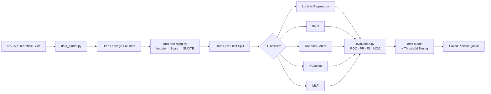

# Exoplanet ML Classifier — NASA KOI

```text
███████╗██╗  ██╗ ██████╗ ██████╗ ██╗      █████╗ ███╗   ██╗███████╗████████╗
██╔════╝╚██╗██╔╝██╔═══██╗██╔══██╗██║     ██╔══██╗████╗  ██║██╔════╝╚══██╔══╝
█████╗   ╚███╔╝ ██║   ██║██████╔╝██║     ███████║██╔██╗ ██║█████╗     ██║
██╔══╝   ██╔██╗ ██║   ██║██╔═══╝ ██║     ██╔══██║██║╚██╗██║██╔══╝     ██║
███████╗██╔╝ ██╗╚██████╔╝██║     ███████╗██║  ██║██║ ╚████║███████╗   ██║
╚══════╝╚═╝  ╚═╝ ╚═════╝ ╚═╝     ╚══════╝╚═╝  ╚═╝╚═╝  ╚═══╝╚══════╝   ╚═╝
ML CLASSIFIER — NASA Exoplanet Archive (KOI)
```


---

## Description

This project applies supervised binary classification to the **NASA Exoplanet Archive
Cumulative KOI (Kepler Object of Interest) Table**, predicting whether a KOI candidate
is a genuine exoplanet (`CANDIDATE`) or a false positive (`FALSE POSITIVE`).
Five classifier families are compared — Logistic Regression, K-Nearest Neighbours,
Random Forest, XGBoost, and MLP — evaluated on F1, ROC-AUC, and MCC.

It continues the *Exoplanet Hunter AI* work developed by the **ECI Centauri Team** at
the NASA Space Apps Challenge 2025 (Global Finalist), bringing rigorous ML methodology
and reproducibility standards to the same exoplanet vetting problem that motivated the
original hackathon prototype.

---

## Pipeline Diagram



---

## Results

> Run notebooks 01 → 04 to populate this table after experiments.

| Model               | F1  | ROC-AUC | Balanced Acc | MCC |
| ------------------- | --- | ------- | ------------ | --- |
| logistic_regression | TBD | TBD     | TBD          | TBD |
| knn                 | TBD | TBD     | TBD          | TBD |
| random_forest       | TBD | TBD     | TBD          | TBD |
| xgboost             | TBD | TBD     | TBD          | TBD |
| mlp                 | TBD | TBD     | TBD          | TBD |

---

## Repository Structure

```text
exoplanet-ml-classifier/
├── .github/workflows/ci.yml       # Lint + test CI workflow
├── data/
│   ├── raw/                        # Place cumulative_koi.csv here
│   └── processed/                  # Generated train/val/test CSVs
├── notebooks/
│   ├── 01_eda.ipynb
│   ├── 02_preprocessing.ipynb
│   ├── 03_models_and_metrics.ipynb
│   └── 04_final_presentation.ipynb
├── reports/figures/                # All saved figures
├── src/
│   ├── constants.py
│   ├── data_loader.py
│   ├── preprocessing.py
│   ├── models.py
│   ├── evaluation.py
│   └── visualization.py
├── tests/
│   ├── test_data_loader.py
│   ├── test_preprocessing.py
│   └── test_models.py
├── COMMIT_CONVENTION.md
├── requirements.txt
└── setup.py
```

---

## Reproduction Instructions

### 1. Clone the repository

```bash
git clone https://github.com/AnderProgramming/exoplanet-ml-classifier.git
cd exoplanet-ml-classifier
```

### 2. Create and activate a virtual environment

```bash
python3.11 -m venv .venv
# On Linux/macOS:
source .venv/bin/activate
# On Windows:
.venv\Scripts\activate
```

### 3. Install dependencies

```bash
pip install -r requirements.txt
# Optional: install the package in editable mode
pip install -e .
```

### 4. Download the KOI dataset

1. Go to the [NASA Exoplanet Archive](https://exoplanetarchive.ipac.caltech.edu/cgi-bin/TblView/nph-tblView?app=ExoTbls&config=cumulative)
2. Click **Download Table → CSV Format**
3. Save the file as `data/raw/cumulative_koi.csv`

Alternatively, use the direct TAP API:

```bash
curl "https://exoplanetarchive.ipac.caltech.edu/TAP/sync?query=select+*+from+cumulative&format=csv" \
     -o data/raw/cumulative_koi.csv
```

### 5. Run the notebooks in order

```bash
jupyter notebook
```

Open and execute each notebook **top to bottom**:

| Notebook | Description |
| -------- | ----------- |
| `01_eda.ipynb` | Exploratory data analysis — distributions, correlations, PCA |
| `02_preprocessing.ipynb` | Leakage removal, SMOTE, train/val/test split |
| `03_models_and_metrics.ipynb` | Train all 5 models, tune XGBoost & MLP, visualise results |
| `04_final_presentation.ipynb` | End-to-end pipeline, all figures, best model saved |

### 6. Run the test suite

```bash
pytest tests/ -v
```

---

## Data Source

### NASA Exoplanet Archive — Cumulative KOI Table

- **URL:** [Cumulative KOI Table](https://exoplanetarchive.ipac.caltech.edu/cgi-bin/TblView/nph-tblView?app=ExoTbls&config=cumulative)
- **Direct TAP API:** [TAP endpoint](https://exoplanetarchive.ipac.caltech.edu/TAP/sync?query=select+*+from+cumulative&format=csv)
- **Citation:** NASA Exoplanet Archive (2024). Kepler Objects of Interest (KOI) Cumulative Table. IPAC.

The cumulative table contains ~9,500 rows with photometric transit parameters,
stellar properties, and NASA's vetting disposition for each KOI candidate.

---

## Authors

**Andersson David Sánchez Méndez** — [GitHub: AnderssonProgramming](https://github.com/AnderssonProgramming)

**Cristian Santiago Pedraza Rodríguez** — [GitHub: cris-eci](https://github.com/cris-eci)

---

## NASA Space Apps Challenge 2025 — ECI Centauri Team

This project is a continuation of the *Exoplanet Hunter AI* created by the
**ECI Centauri Team** at the NASA Space Apps Challenge 2025, where the project
was selected as a **Global Finalist**. The original prototype demonstrated
a rapid-prototype ML pipeline for KOI vetting; this repository implements it
with production-quality code, rigorous evaluation, and full reproducibility.

---

## License

[Apache License Version 2.0](LICENSE)
